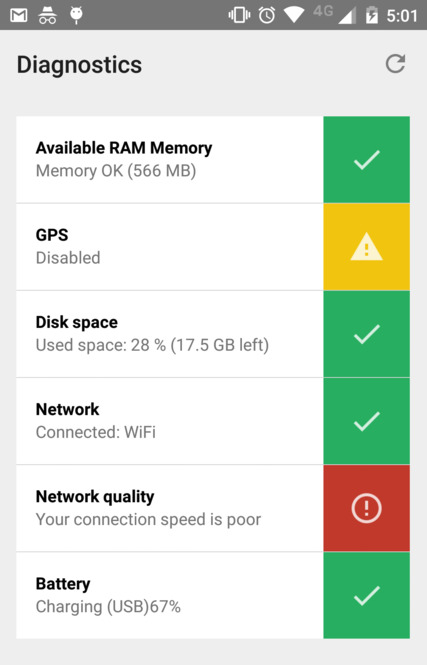

An extensible diagnostics activity for Android.

Uses Android's data binding framework, which is still in beta, so expect changes.

## Implemented checks

- RAM Memory
- GPS enabled
- Disk space
- Network connection
- Network quality (speed)
- Battery status
- NTP time sync

## Contributing

Contributions are welcome! Here are a few ideas:

1. Setup a result (to be used along with `startActivityForResult`)
2. `NetworkQualityCheck` needs to be more stable, and provide uplink/downlink checks
3. Sensor checks are welcome
4. Create an icon
5. Coordinator layout for ActionBar + ListView
6. Add kbps measurement to `NetworkQualityCheck`
